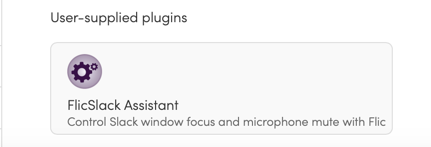

# FlicSlack Assistant Plugin
    Was tested on macOS Ventura (Version 13.3.1)

## Actions
 * _Show Slack window_ - moves the Slack window in focus.
 * _Mute/unmute mic while Huddle call_ - toggles the microphone during Slack Huddle calls. 

## Installation
 1. Download or checkout repository.
 2. Make sure [the Flic App](https://flic.io/mac-app) is installed on your macOS.
 3. Provide the Flic App with the proper permissions: go to `System Settings` -> `Privacy & Security` -> `Accessibility` and Add Flic app to the list.
 4. Execute `scripts/deploy.sh` script to copy plugin folder to the Flic plugins directory.
 5. Restart the Flic App.
 7. The FlicSlack Assistant plugin should be available under the `User-supplied plugins` section: 

## Scripts
 * deploy.sh - copies the `flicslack-assistant-plugin` directory to the Flic plugins folder(`~/Library/Application\ Scripts/com.shortcutlabs.FlicMac/`).
 